# Overview

<br>

This repository contains a full-stack web application inspired by Airbnb, with features including, but not limited to:

- ## Authentication <br>

  - desktop:<br>
    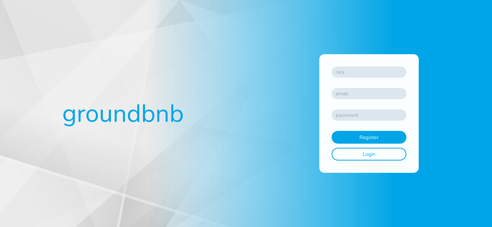
  - mobile:<br>
    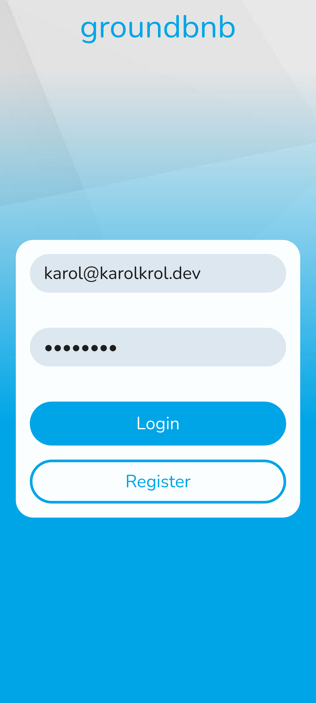 <br>

  ### Description

  When user signs in or registers, they are granted JWT access and refresh tokens, viable for 20 mins and 7 days, respectively.
  Axios interceptors add appropriate Authentication header with token read from local storage on every API call,
  assuring that server responds correctly to guarded resources. If access token expired, interceptor tries to make
  a request to token refresh path with refresh token as Bearer. If token is valid, server responds with new credentials
  and they are updated on client side. Passwords are hashed using scrypt() function.

- ## Browsing properties <br>

  - desktop: <br>
    <div style="height: 500px; overflow: hidden"><div></div></div>
  - mobile: <br>
    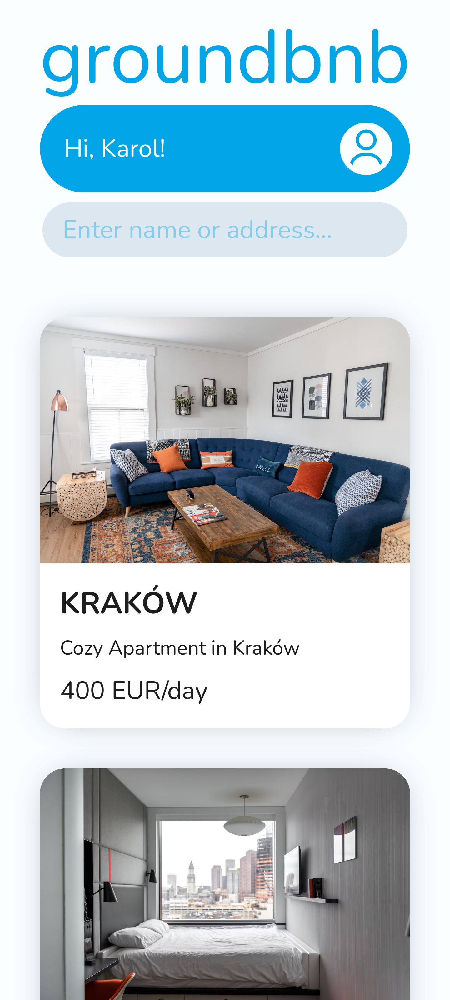 <br>
    ### Description
    Dashboard (or landing page) is visible to the user under root path. Search bar at the top allows for finding matching text
    in `name`, `city` or `description` fields in `properties` table in the database. Backend path for retrieving list of properties
    does not require authentication.

- ## Property data <br>

  - desktop:<br>
    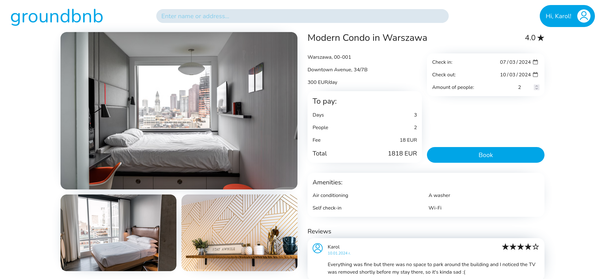
  - mobile:<br>
    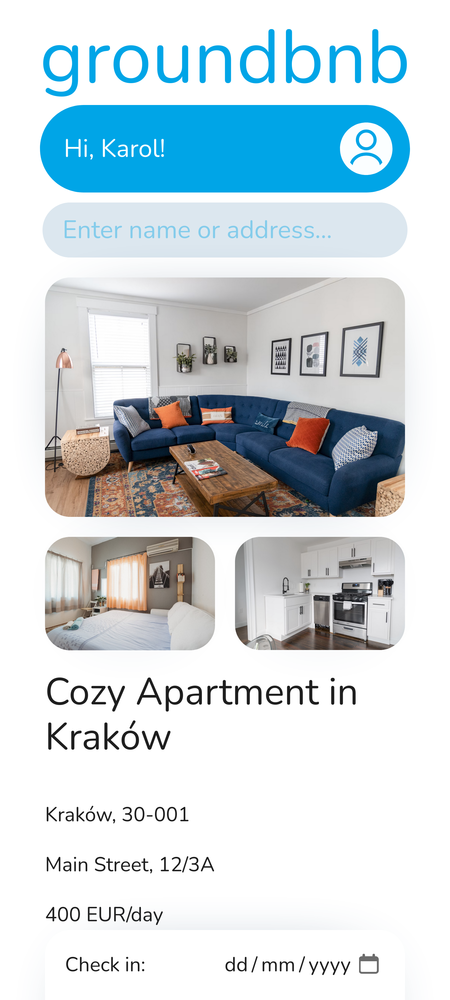 <br>

  ### Description

  User can click on property listed on the main page, which will transfer him to `/property/:id`. Under this path
  client makes a request to the backend to retrieve property of id read from `:id` parameter. During loading
  waiting screen is shown. After server responds with property data, screens above (desktop or mobile) are displayed
  to the user. User can now make a reservation by selecting desired date range in the inputs labeled "Check-in" and "Check-out", as well as enter amount of people. If property is booked in any of days selected by the user, message informing about inability to book is shown. However, if it is available, user sees Total amount to pay and 'Book' button, which submits book request or transfers to login page if user was not logged in prior to submitting.

- ## Profile info <br>

  - desktop:<br>
    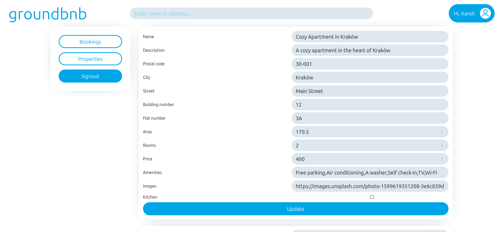<br>
    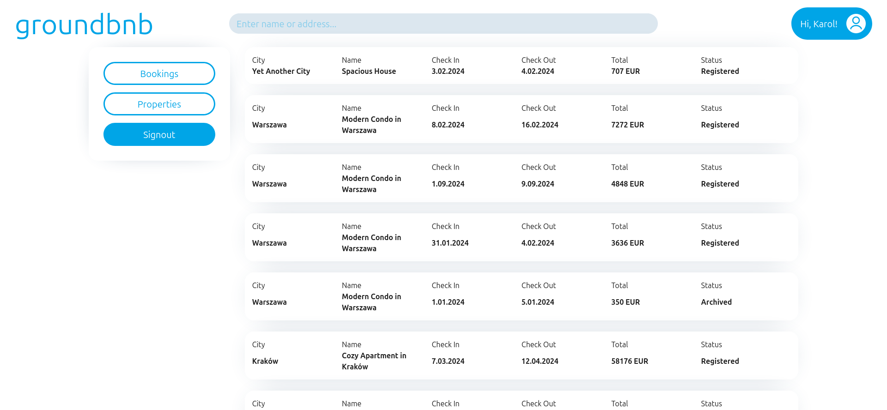<br>
    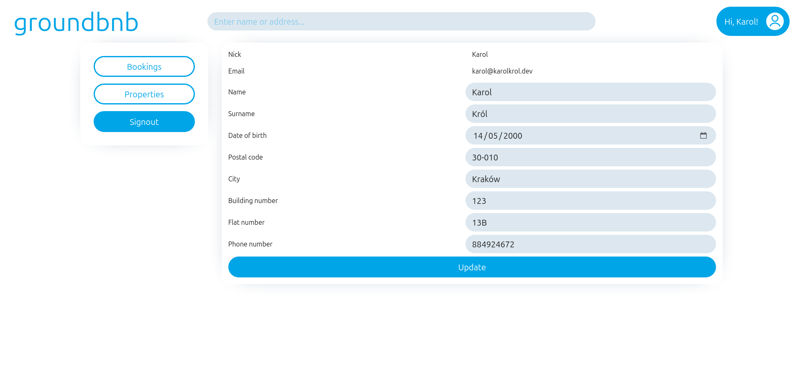
  - mobile:<br>
    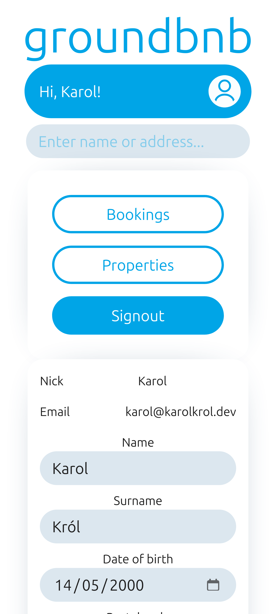
    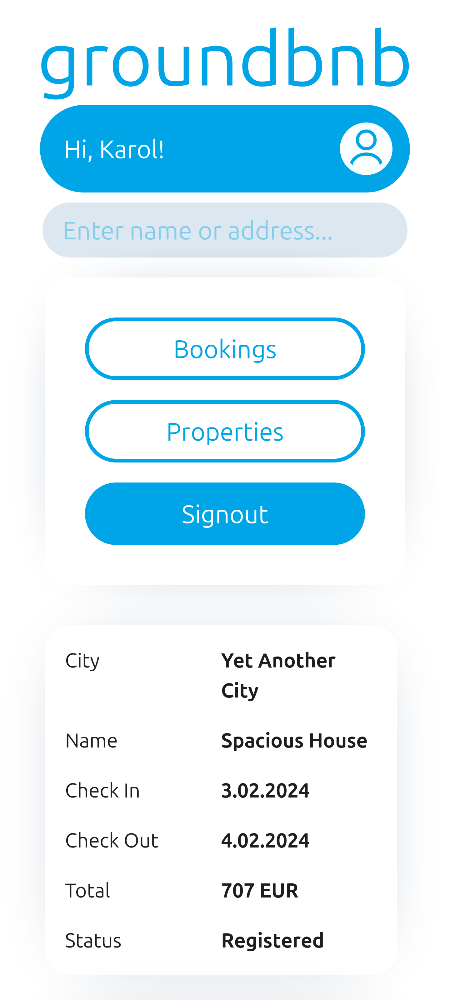
    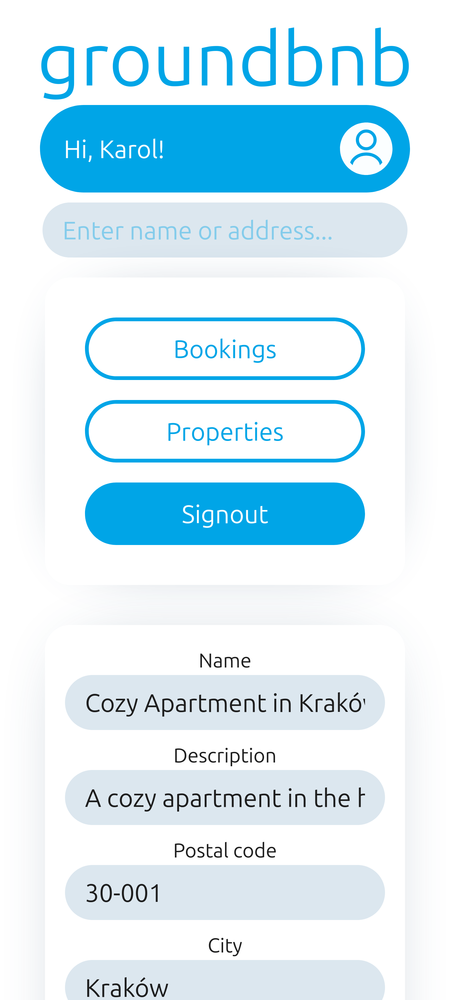

  ### Description

  After clicking on user button in the top right corner (assuming user is logged in), they are transferred to profile info page. There they can sign out, update their profile information, see their booking and its' status, as well as edit and add their own property listings.

# Tech stack

- frontend: ReactJS + TypeScript
- backend: NestJS
- database: PostgreSQL + TypeORM
- containerization: Docker with docker compose

# Database

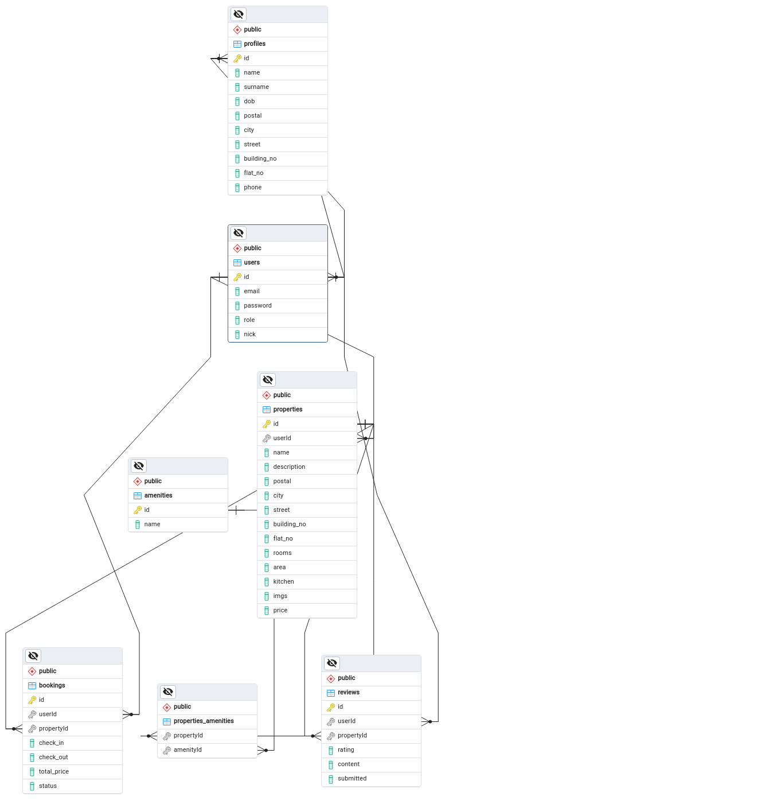<br>
Database consists of 7 tables:

- users - store users' basic data, such as nick, email, encrypted password.
- profiles - one-to-one relation with users by ids, store users' additional info, every column is optional.
- properties - store property info. One-to-many relation with reviews, one-to-many relation with bookings, many-to-one relation with users, many-to-many relation with properties_amenities.
- properties_amenities - serves as a join table for properties and amenities. Stored ids connecting entries.
- bookings - stores info about bookings, like user (many-to-one relation), property (many-to-one relation) and columns specific to bookings.
- reviews - many-to-one relation with users, meny-to-one relation with properties. Users that booked property in the past are eligible for one review for that property.

# Running in local environment

- clone repository:

```console
git clone https://github.com/p1rv/groundbnb.git && cd groundbnb
```

- create .env file in /backend directory:

```console
touch backend/.env
```

- set necessary keys in .env file:

```
POSTGRES_HOST=""
POSTGRES_PORT=""
POSTGRES_USER=""
POSTGRES_PASSWORD=""
POSTGRES_DATABASE=""
JWT_SECRET=""
```

Remember to set up VPC Security Groups correctly if you are using cloud hosted database.

- run the environment:

```console
docker-compose up --build
```

## Access the application

Backend API: http://localhost:3050/api

Frontend: http://localhost:3050
